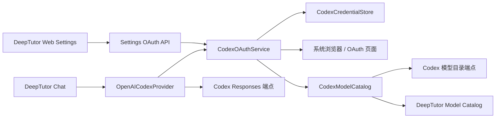

# DeepTutor Codex OAuth Provider 与动态模型目录设计

日期：2026-07-24

状态：已确认设计，待用户审阅书面规格

基线：DeepTutor v1.5.3（提交 `3a19752a`）

参考实现：CSSwitch 提交 `4e0af6ba7909dca22f1257b168172ecbe4af4836`

## 1. 背景与现状修正

DeepTutor 当前已经注册了 `openai_codex` Provider，并实现了面向
`https://chatgpt.com/backend-api/codex/responses` 的 Responses 流式请求、工具调用转换和
`chatgpt-account-id` 请求头处理。CLI 也提供了
`deeptutor provider login openai-codex`。

但这不等于 DeepTutor 已经具备完整的 Web OAuth 产品路径。当前 Settings 页面仍把
OpenAI Codex 当作普通 API Provider，展示 Base URL 和 API Key；后端没有提供 Web OAuth
启动、状态、取消、登出和动态模型目录 API；模型列表仍以本地静态配置为主。现有 CLI
登录依赖 `oauth-cli-kit`，其默认行为还可能导入本机 Codex CLI 凭据，与“DeepTutor 独立
认证、绝不接触 `~/.codex`”的目标冲突。

本设计补齐的是这条缺失的产品闭环，而不是重写已经可用的 Responses 推理协议。

## 2. 目标

1. 在 DeepTutor Web Settings 中提供一次跳转式 Codex OAuth 登录。
2. 使用 DeepTutor 自己的凭据空间，绝不读取、复制、修改或删除 `~/.codex`。
3. 登录后从当前账户实时拉取 Codex 模型目录，并在 DeepTutor 自己的模型选择器中展示。
4. 只有实时目录明确返回原始模型 ID `gpt-5.6-sol` 时，才自动把当前模型切换为该模型。
5. Codex 请求消耗该 ChatGPT/Codex 登录账户所对应的可用计划额度，不使用
   `OPENAI_API_KEY`，也不在失败时自动退回付费 API。
6. 复用 CSSwitch 中经验证的 OAuth、并发刷新、缓存和状态机思路，同时保持 DeepTutor
   的 Python/FastAPI/Next.js 架构。
7. 保留现有 DeepTutor SSE、reasoning 和工具调用能力，避免引入额外网关。

## 3. 非目标

- 不实现多账户、轮换账户、额度聚合或规避限额。
- 不接管 Codex CLI，不与 Codex CLI 的登录状态联动。
- 不读写任何原生 Codex 配置或认证文件。
- 不实现 Anthropic 协议转换、Science 别名、通用反向代理或 CSSwitch 的完整 Rust 网关。
- 不引入 Codex app-server。
- 不承诺 `chatgpt.com/backend-api/codex/*` 是稳定的公开 API。
- 不在 Codex 失败时自动切换到 OpenAI API Key、SiliconFlow 或其他可能产生费用的
  Provider。
- 不允许用户手填一个未由账户目录返回的 Codex 模型 ID。

## 4. 已确认的产品决策

### 4.1 认证边界

DeepTutor 使用独立 OAuth 客户端流程和独立凭据存储。实现和测试都必须证明：

- 不探测 `~/.codex` 是否存在；
- 不从 Codex CLI 导入 token；
- 不向 Codex CLI 导出 token；
- 登出只清理 DeepTutor 私有目录；
- 前端、Settings JSON、日志和异常信息都不出现 access token、refresh token、用户邮箱或
  完整 account ID。

### 4.2 Web 与模型选择

浏览器只承担 OAuth 授权跳转。登录状态、模型目录和模型切换全部留在 DeepTutor Web
内部。OpenAI Codex Provider 选中后：

- 隐藏 Base URL、API Key 和手工新增模型输入；
- 显示 Codex 登录卡片；
- 登录后显示该账户实际返回的模型；
- 使用现有 DeepTutor 模型选择器完成后续人工切换。

### 4.3 默认模型

成功登录后必须先完成一次**实时**模型目录拉取。只有返回列表中存在完全相同的原始 ID
`gpt-5.6-sol` 时，系统才：

1. 创建或更新受管理的 OpenAI Codex Profile；
2. 备份切换前的 Provider 和模型；
3. 保存新的模型目录；
4. 将当前 Provider/模型切换为 `openai_codex` / `gpt-5.6-sol`。

不得通过大小写变换、显示名、别名或版本猜测来判定命中。实时目录不含 Sol、目录请求
失败或 OAuth 失败时，原有活动模型保持不变；不得静默回退到 Terra、Luna 或其他模型。

## 5. 兼容性与风险边界

OpenAI Codex 使用 ChatGPT 登录并按相应计划提供使用额度，是 Codex 的官方登录模式；
API Key 模式则使用 OpenAI Platform 计费。这里采用前者的认证概念。

但是，DeepTutor 当前直接使用的
`https://chatgpt.com/backend-api/codex/responses` 和模型目录端点不是面向第三方应用承诺
稳定性的公开 API。CSSwitch 也把这条桥接路径标记为实验性。因此：

- OAuth/目录/推理端点全部封装在 `openai_codex` 专属模块内；
- UI 明示“实验性 Codex 登录”；
- 错误提示区分认证失效、模型不可用、账户限额和上游兼容性变化；
- 上游协议变化不得影响其他 DeepTutor Provider；
- 实现时必须逐项对照当时的官方 OpenAI Codex 源码和文档，不能只复制 CSSwitch 常量。

## 6. 总体架构

本功能由四个边界清晰的组件组成。

### 6.1 `CodexOAuthService`

负责 OAuth 登录操作、PKCE、state 校验、token 交换、刷新、取消、超时和登出。它是凭据
的唯一读写入口，并向调用方只返回不含秘密的状态对象。

### 6.2 `CodexCredentialStore`

负责 DeepTutor 私有凭据目录、文件锁、原子写入、认证 generation、损坏文件处理和
符号链接/重解析点防护。业务层不能直接打开凭据文件。

### 6.3 `CodexModelCatalog`

使用当前凭据获取账户模型目录，解析原始模型 ID 和展示元数据，管理 ETag、短期缓存、
过期可读缓存及认证隔离。它不选择模型，只提供可验证的目录快照。

### 6.4 现有 `OpenAICodexProvider`

继续负责 Responses 请求、SSE 解析、reasoning 和工具调用转换。它改为从
`CodexOAuthService` 获取可用 token 和 account ID，不再直接调用可导入 Codex CLI
凭据的旧存储。



## 7. 私有数据与存储

### 7.1 路径

所有 Codex 私有文件放在 `PathService.get_user_root()` 下的专用私有目录：

```text
<user-root>/private/openai-codex/
  credentials.v1.json
  state.v1.json
  models-cache.v1.json
  auth.lock
```

单用户默认对应 `data/user/private/openai-codex/`；多用户模式自动落到当前管理员作用域的
`data/users/<uid>/user/private/openai-codex/`。这些文件不进入 Settings 导出、模型配置
草稿或前端响应。

### 7.2 文件职责

`credentials.v1.json`：

- access token；
- refresh token；
- token 类型和过期时间；
- 完整 account ID；
- 当前认证 generation；
- 凭据 schema 版本。

`state.v1.json`：

- 当前是否已连接；
- 认证 generation；
- 上次成功刷新时间；
- 自动切换前的 Provider/模型备份；
- 上次目录状态和可公开错误码；
- 不包含 token、邮箱或完整 account ID。

`models-cache.v1.json`：

- 认证 generation；
- account ID 的单向哈希分区键；
- ETag；
- 获取时间；
- 原始模型 ID、显示名、优先级、reasoning 能力等非敏感目录信息。

### 7.3 文件安全

- 写入使用“同目录临时文件 + flush/fsync + 原子替换”。
- token 刷新和登出在 `auth.lock` 下串行化。
- 每次提交凭据递增 generation，旧刷新结果不得覆盖新登录。
- Windows 上使用所有者限制 ACL 的最佳可用实现；支持 POSIX 权限的平台使用
  owner-only 权限。
- 打开已有文件前检查其解析后路径仍在私有目录内，并拒绝符号链接或 Windows 重解析点。
- 支持相应标志的平台使用 no-follow 打开；不支持的平台仍执行显式路径和文件类型检查。
- 凭据 JSON 损坏时进入“需要重新登录”状态，不尝试从 `~/.codex` 修复。

## 8. OAuth 操作协议

### 8.1 登录启动

Web 调用：

```http
POST /api/v1/settings/providers/openai-codex/oauth/start
```

返回：

```json
{
  "operation_id": "opaque-random-id",
  "authorize_url": "https://auth.openai.com/...",
  "expires_in": 300
}
```

前端用新窗口打开 `authorize_url`，随后轮询状态 API。后端为每次登录生成：

- 高熵 PKCE verifier；
- S256 code challenge；
- 高熵 state；
- 一次性 operation ID；
- 五分钟绝对截止时间。

回调监听仅绑定 `127.0.0.1`，优先端口 1455，冲突时尝试 1457。端口、client ID、scope、
authorize/token URL 和回调语义在实现时统一放入一个配置模块，并对照当时的官方 Codex
源码验证。

每个管理员作用域同一时间只允许一个活动登录操作。重复启动返回现有未过期操作的状态，
不创建并发监听器。

### 8.2 状态查询

```http
GET /api/v1/settings/providers/openai-codex/oauth/status
```

返回统一的脱敏状态：

```json
{
  "connection": "disconnected|authorizing|connected|error",
  "operation_id": "opaque-random-id-or-null",
  "operation_state": "waiting|exchanging|fetching_models|completed|cancelled|expired|failed|null",
  "model_count": 0,
  "catalog_source": "live|cache|null",
  "catalog_fetched_at": null,
  "active_model": null,
  "auto_switched": false,
  "sol_available": false,
  "error_code": null
}
```

响应不返回 token、邮箱、授权码、PKCE verifier、完整 account ID 或上游原始错误正文。

### 8.3 取消、登出和目录刷新

```http
POST /api/v1/settings/providers/openai-codex/oauth/cancel
POST /api/v1/settings/providers/openai-codex/oauth/logout
POST /api/v1/settings/providers/openai-codex/models/refresh
```

- `cancel` 只终止当前等待中的登录操作，不影响已经提交的旧凭据。
- `logout` 在存在进行中 Codex 推理时拒绝执行，并提示先停止生成。
- `logout` 尽力调用上游 revoke；无论 revoke 是否可用，都在锁内使本地 generation
  失效并清除本地凭据和目录缓存。
- `logout` 仅在当前仍选中受管理 Codex 模型时，恢复自动切换前保存的 Provider/模型；
  如果用户后来已主动切换到其他 Provider，则保留用户选择。若备份模型已被用户删除，也
  保持当前配置不变并提示用户选择，不擅自猜测替代项。完成登出后清除该回退点。
- `refresh` 强制跳过五分钟新鲜缓存，但仍要求有效认证。

这些 Settings API 在首版均为管理员权限，因为现有活动模型配置也是管理员管理的全局
设置。多用户普通成员不能启动、查看或清除管理员 Codex 凭据。

### 8.4 后端进程重启

活动 operation 只保存在内存中。进程重启后，未完成登录自动失效，回调监听器消失；
已经原子提交的凭据和目录缓存保持有效。状态 API 返回已连接状态或要求重新登录，不恢复
中断的 OAuth operation。

## 9. 登录提交与模型自动切换事务

完整成功路径如下：

1. 校验回调来源、state、operation ID 和截止时间。
2. 用 PKCE verifier 交换 token。
3. 验证 token 响应包含所需字段和账户标识。
4. 在文件锁内原子提交新凭据并递增 generation。
5. 使用新 generation 发起实时模型目录请求。
6. 原子保存目录缓存，并把目录同步到 DeepTutor 受管理模型配置。
7. 精确查找原始 ID `gpt-5.6-sol`。
8. 若存在，且本次是自动切换入口，则保存原选择并切换到 Sol。
9. 将 operation 标记为 completed。

凭据提交和模型目录提交是两个明确阶段：

- token 交换失败：旧凭据、旧目录和旧活动模型全部保持不变；
- token 已提交但目录失败：保持新的已登录状态，但不修改活动模型；
- 目录成功但 Sol 不存在：保存并展示真实目录，但不修改活动模型；
- 活动模型配置保存失败：凭据和目录仍有效，状态返回
  `model_activation_failed`，并保留旧活动模型。

`previous_selection` 只在系统首次自动从非目标选择切换到 Sol 时写入。重新登录、目录刷新
或用户在 Codex 模型间人工切换不得覆盖这份回退点。用户主动切换到其他 Provider 后，
系统不自动把其拉回 Sol。

## 10. 动态模型目录

### 10.1 获取与解析

`CodexModelCatalog` 访问当前 Codex 账户的实验性模型目录端点
`https://chatgpt.com/backend-api/codex/models`，并保留上游返回的原始 ID。该 URL 必须
集中配置，以便上游变化时只修改 Codex 兼容层。解析范围以 DeepTutor UI 和推理需要为限：

- 原始模型 ID；
- display name；
- priority；
- 默认和支持的 reasoning levels；
- reasoning summary 支持；
- parallel tool calls 支持；
- Responses Lite 等上游能力标记。

未知字段忽略并保留向前兼容；缺少原始模型 ID 的记录直接丢弃。最多接收 512 个模型，
响应体上限 8 MiB。

### 10.2 缓存

- 新鲜缓存：5 分钟；
- 最后可用缓存：24 小时；
- 请求携带并处理 ETag；
- 缓存必须同时匹配 account 哈希和认证 generation；
- 重新登录、账户变化、登出、401 或 403 都立即使缓存失效；
- 过期缓存只用于已登录页面的降级展示，不得触发首次自动切换到 Sol；
- 自动切换只能由本次登录后的实时 `live` 目录触发。

### 10.3 DeepTutor 模型目录同步

同步仅维护标记为 `managed_by: "openai_codex_oauth"` 的条目：

- 按实时目录新增、更新或移除受管理 Codex 模型；
- 不修改其他 Provider 或用户已有条目；
- Web 把这些条目显示为只读；
- 登出后移除受管理 Codex 模型，避免已失效模型继续可选；
- 聊天历史中的既有模型文本不被重写或删除。

## 11. Provider 注册与推理行为

Provider 元数据增加：

```json
{
  "auth_mode": "oauth",
  "model_policy": "dynamic_catalog",
  "requires_api_key": false,
  "experimental": true
}
```

Settings 后端把这些字段返回给 Web，Web 据此渲染 OAuth 卡片，而不是依赖 Provider 名称
硬编码普通表单。

推理前：

1. 读取当前 DeepTutor 私有凭据；
2. 若 token 即将过期，在锁内刷新；
3. 再次检查 generation，防止旧刷新覆盖新登录或登出；
4. 向现有 Responses 请求注入 bearer token 和 account ID；
5. 使用模型目录中的原始模型 ID。

运行时策略：

- 首次 401：使凭据状态失效并尝试刷新，供下一次请求使用；不重放当前请求，避免工具调用
  或生成内容重复。
- 403：标记认证/账户不可用，失效目录，要求重新登录。
- 429：明确显示 Codex 额度或速率限制，不切换到付费 API。
- 模型不存在：刷新目录并提示重新选择，不猜测别名。
- SSE 或网络中断：结束当前生成并保留可见错误，不切换 Provider。
- `OPENAI_API_KEY` 即使存在也不参与 `openai_codex` Provider。

CLI 的 `deeptutor provider login openai-codex` 保留，但改为调用同一个
`CodexOAuthService` 和同一个 DeepTutor 私有存储，行为与 Web 一致。旧的 Codex CLI
凭据导入路径被禁用或移除。

## 12. Web 交互

### 12.1 未登录

OpenAI Codex 卡片显示：

- “使用 Codex 登录”主按钮；
- 实验性与兼容性提示；
- “不会读取本机 Codex CLI 登录，也不会使用 API Key”的说明。

不显示 Base URL、API Key、Extra headers 或手工模型输入。

### 12.2 登录中

页面显示“等待浏览器授权”，允许取消，并轮询脱敏状态。浏览器窗口被用户关闭时，后端在
五分钟截止后变为 expired；旧模型配置不变。

### 12.3 已登录

页面显示：

- 已连接状态；
- 目录来源（实时或缓存）和更新时间；
- 模型数量；
- 刷新模型按钮；
- 登出按钮；
- 账户实际返回的受管理模型列表。

不显示邮箱或完整账户标识。现有模型选择器展示这些动态模型，并把上游 display name
作为友好标签、原始 ID 作为实际请求值。

### 12.4 Sol 自动切换反馈

- 命中：显示“已切换到 Codex / GPT-5.6-Sol”。
- 未命中：显示“当前账户目录未返回 `gpt-5.6-sol`，已保留原模型”，并允许用户从真实
  目录人工选择。
- 目录失败：显示“登录成功，但暂时无法读取模型目录，原模型未变”。

以上三种状态必须可区分，不能用统一“登录成功”掩盖后续失败。

## 13. 错误模型

后端向 Web 返回稳定错误码和安全消息，至少包括：

- `oauth_cancelled`
- `oauth_expired`
- `oauth_state_mismatch`
- `oauth_callback_bind_failed`
- `oauth_exchange_failed`
- `credential_corrupt`
- `credential_write_failed`
- `catalog_fetch_failed`
- `catalog_unauthorized`
- `catalog_forbidden`
- `catalog_invalid_response`
- `sol_not_available`
- `model_activation_failed`
- `inference_in_progress`
- `codex_rate_limited`
- `codex_upstream_changed`

上游响应正文只进入受控诊断摘要；任何日志过滤器都必须清除 bearer、refresh token、
authorization code、PKCE verifier、邮箱和完整 account ID。

## 14. CSSwitch 复用范围与来源声明

CSSwitch 采用 MIT License。本项目仅选择性移植其机制，不复制完整架构。

计划参考：

- `desktop/gateway/src/codex_auth/login_async.rs`
  - PKCE-S256、state、loopback callback、取消、超时和结构化错误。
- `desktop/gateway/src/codex_auth/storage.rs`
  - 独立凭据、generation、文件锁、原子提交、并发刷新和登出失效。
- `desktop/gateway/src/codex_models.rs`
  - 动态模型解析、ETag、5 分钟/24 小时缓存和 401/403 失效。
- `desktop/src-tauri/src/commands/codex.rs`
  - 操作状态协议和脱敏视图。
- CSSwitch Web 状态机
  - 登录、等待、成功、失败、刷新和登出反馈。

明确不复用：

- Rust gateway 和 Tauri sidecar/supervisor；
- Anthropic 协议翻译；
- Science 别名；
- 多账户或轮换逻辑；
- `oauth_forge.rs`；
- 与 DeepTutor 需求无关的网关配置。

实现以 Python 测试驱动适配为主，不做逐行机械翻译。若实际实现实质性移植 CSSwitch 代码
或算法结构，新增 `THIRD_PARTY_NOTICES.md`，注明：

- 项目：SuperJJ007/CSSwitch；
- 来源提交：`4e0af6ba7909dca22f1257b168172ecbe4af4836`；
- 许可证：MIT；
- 被适配文件与 DeepTutor 对应模块；
- 保留原版权和许可证文本。

CSSwitch 中的 client ID、scope、端口、端点和请求头仅作为研究线索，实施时必须与当时的
官方 Codex 源码和 OpenAI 文档交叉验证。

## 15. 预期改动范围

后端只触及与该 Provider 直接相关的边界：

- 新增 Codex OAuth 服务、凭据存储和模型目录模块；
- 扩展 `openai_codex` Provider 注册元数据；
- 扩展 Settings API；
- 让现有 `OpenAICodexProvider` 使用新认证服务；
- 让 CLI 登录复用新服务；
- 对模型目录增加受管理动态条目的最小字段支持。

前端只触及：

- Provider 连接表单的 OAuth 渲染分支；
- Codex 登录卡片和状态轮询；
- 动态模型展示；
- 现有模型选择器对受管理模型和能力标签的支持。

不借此重构其他 Provider、Settings 页面布局或通用聊天架构。

## 16. 测试设计

### 16.1 OAuth 单元与集成测试

- verifier/challenge 符合 PKCE-S256；
- state 正确、错误、缺失和重复回调；
- 取消、超时、端口冲突和 callback bind 失败；
- token 交换失败不覆盖旧凭据；
- 一个用户只存在一个活动 operation；
- 重启后 operation 失效而已提交凭据仍可用。

### 16.2 凭据安全测试

- 临时文件原子替换；
- 两个并发刷新只有有效 generation 可提交；
- 登出期间的迟到刷新不能复活凭据；
- 损坏 JSON 进入重新登录状态；
- 符号链接/重解析点被拒绝；
- 支持平台上的所有者权限符合要求；
- 测试用监视器证明整个登录、刷新和登出流程没有读取或修改 `~/.codex`；
- API、异常和捕获日志不含 token、邮箱或完整 account ID。

### 16.3 模型目录测试

- 真实风格 fixture 的解析、排序和能力字段；
- 未知字段兼容、缺 ID 丢弃、数量和体积上限；
- ETag、5 分钟新鲜缓存、24 小时最后可用缓存；
- account 哈希和 generation 隔离；
- 重新登录、登出、401 和 403 失效；
- 只有实时原始 ID 精确等于 `gpt-5.6-sol` 才自动切换；
- 显示名、大小写变体、旧缓存或别名均不能触发自动切换；
- Sol 缺失、目录失败和 OAuth 失败都保留原模型。

### 16.4 Provider 回归测试

- Responses 流式文本；
- reasoning 内容；
- 工具定义转换、工具调用和工具结果；
- account header；
- token 预刷新；
- 401 不重放当前推理；
- 429 不使用 API Key 或其他 Provider；
- SSE 和网络错误不触发 Provider fallback。

### 16.5 Web 测试

- OAuth Provider 不显示 API Key/Base URL；
- disconnected、authorizing、connected、error 状态；
- 轮询结束条件、取消和超时；
- 动态模型列表和只读标记；
- Sol 命中、缺失和目录失败三种反馈；
- 模型选择仍在 DeepTutor 内完成；
- 登出恢复此前选择；
- 登出时存在推理则显示阻止消息。

### 16.6 验证命令

实施计划应使用项目实际脚本完成：

- 相关 Python 单元测试；
- 后端完整 pytest 回归；
- Web 单元测试；
- TypeScript typecheck；
- Next.js production build；
- `git diff --check`。

具体命令在实施计划阶段依据仓库当前 package scripts 和测试布局固定，不在设计阶段猜测。

## 17. 人工验收

真实 OAuth 验收需要用户在场完成浏览器授权。验收步骤：

1. 记录 `~/.codex` 相关文件的存在性、时间戳和哈希。
2. 确认环境中即使存在 `OPENAI_API_KEY`，Codex Provider 也不读取它。
3. 在 DeepTutor Settings 点击“使用 Codex 登录”。
4. 完成浏览器授权并回到 DeepTutor。
5. 确认凭据只出现在 DeepTutor 私有目录。
6. 确认 `~/.codex` 的存在性、时间戳和哈希均未变化。
7. 确认 Web 展示账户实际模型目录。
8. 若目录含原始 ID `gpt-5.6-sol`，确认自动切换；若不含，确认原模型不变。
9. 完成普通聊天、reasoning 和一次工具调用 smoke test。
10. 模拟或等待 401/429，确认没有请求重放或付费 API fallback。
11. 停止所有生成后登出，确认私有 token 和缓存清理、原模型恢复、聊天历史保留。

## 18. 发布与兼容策略

- 实现、测试和文档完成后，以独立功能分支提交 Pull Request；不直接合并到 `main`。
- 首版作为 `openai_codex` 的实验性 OAuth 模式进入，不新增第二个容易混淆的 Provider。
- 旧的手工 API Key 样式 Codex Profile 不再作为有效认证方式；检测到旧配置时只提示迁移，
  不尝试把其中内容当作 OAuth token。
- 非 Codex Provider 的配置、模型和默认行为保持不变。
- 若上游 Codex 端点发生不兼容变化，系统将该 Provider 标记为不可用并给出安全错误，
  不阻断 DeepTutor Settings 或其他模型。
- 动态目录 schema 和私有文件均带版本号，后续升级采用显式迁移；不静默猜测旧格式。

## 19. 成功标准

本功能只有同时满足以下条件才算完成：

1. 用户能从 DeepTutor Web 发起并完成独立 Codex OAuth。
2. 全流程不读取、修改或删除 `~/.codex`。
3. token 和完整账户信息不进入前端、Settings、日志或错误响应。
4. Web 展示登录账户实时返回的模型目录。
5. 仅在实时目录精确包含 `gpt-5.6-sol` 时自动切换到该模型。
6. 任一失败路径都保留原活动模型，且不会自动使用付费 API。
7. 登出清理 DeepTutor 私有认证；当前仍使用受管理 Codex 模型时恢复自动切换前的模型，
   用户已主动切换到其他 Provider 时不覆盖其选择。
8. 现有 Codex Responses 流、reasoning 和工具调用测试继续通过。
9. 后端测试、Web 测试、typecheck、production build 和人工 OAuth 验收全部通过。
10. 实质性 CSSwitch 移植具有完整 MIT 来源声明，并已与官方 Codex 当期实现交叉验证。
